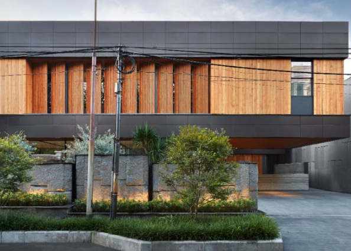
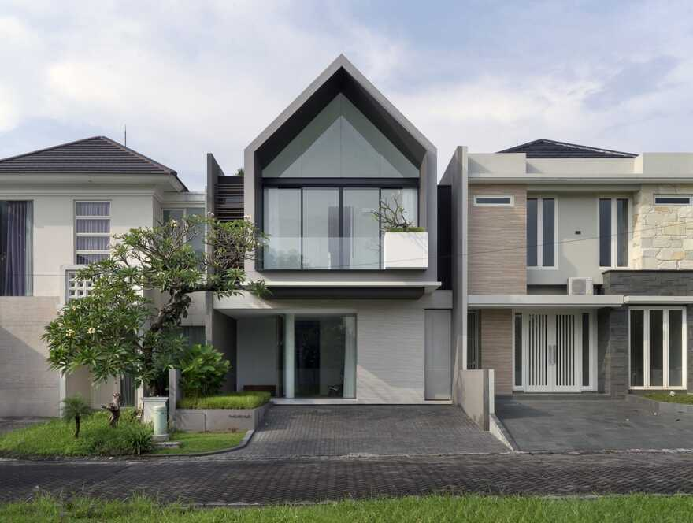
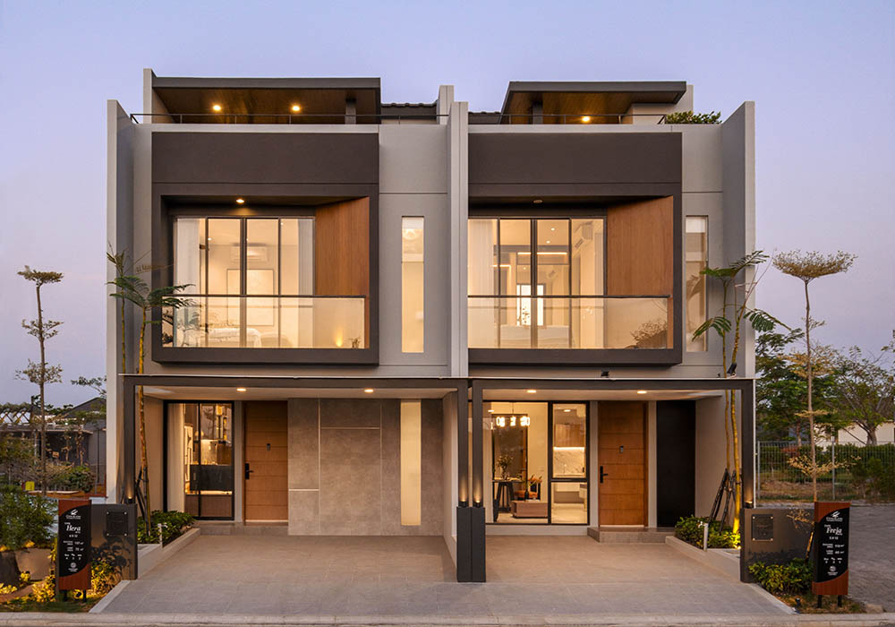
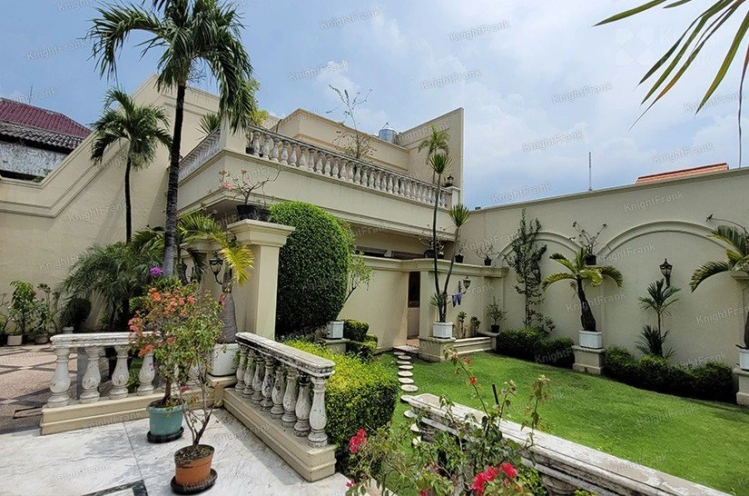

# Module 2 - Karl Christian

[Deployment](https://github.com/revou-fsse-5/module-2-karlchris/deployments/github-pages)

Website URL: [https://revou-fsse-5.github.io/module-2-karlchris/](https://revou-fsse-5.github.io/module-2-karlchris/)

Checkpoint 1:

- Applying custom font using @font-face or embed

```css
/* Custom Font */
@font-face {
    font-family: 'CustomFont';
    src: url('sansation_bold.woff');
    font-weight: bold;
}

body {
    font-family: 'CustomFont', monospace;
    margin: 0;
    padding: 0;
    background-color: #f4f4f4;
}
```

- Applying text-shadow to text and list-style to the list

```css
header h1 {
    margin: 0;
    text-shadow: 2px 2px 4px #fdfdfd;
}
```

- Applying 1 responsive background image, (using contain or cover, suit your needs)

```css
header {
    /* background-color: #333; */
    color: #fff;
    padding: 1em 0;
    text-align: center;
    text-shadow: 2px 2px 4px #ffffff;
    position: sticky;
    top: 0;
    z-index: 1000;

    /* Set the background iamge */
    background-image: url('assets/black-abstract-background-dttk9qafclm4rh3l.png');

    /* Choose 'cover' to fill the entire element or 'contain' to fit the whole image */
    background-size: cover; /* or 'contain' */
    
    /* Center the background image */
    background-position: center;
    
    /* Prevent the background image from repeating */
    background-repeat: no-repeat;
}
```

- Applying 1 responsive image with picture + source + srcset method

```html
<picture class="responsive" alt="Home at Surabaya">
    <!-- High-resolution screens / large devices -->
    <source media="(min-width: 800px)" srcset="assets/large-house.webp">
    
    <!-- Medium-resolution screens / medium devices -->
    <source media="(min-width: 400px)" srcset="assets/medium.png">

    <!-- Low-resolution screens / small devices -->
    
</picture>
```

- Creating one Asymmetrical Grid → layouting grid, both container and item (children)

```css
/* Grid Container */
.grid-container {
    display: grid;
    grid-template-columns: 1fr 1fr; /* 2 columns */
    grid-template-rows: auto auto; /* 2 rows */
    gap: 50px; /* Space between grid items */
}

/* Grid Items - Spanning multiple columns or rows */
.item1 {
    grid-column: 1;
    grid-row: 1;
}

.item2 {
    grid-column: 2;
    grid-row: 2;
}

.item3 {
    grid-column: 1;
    grid-row: 2;
}

.item4 {
    grid-column: 2;
    grid-row: 1;
}
```

```html
<h2 style="font-size:30px;" class="ani-element">Gallery</h2>
  <div class="grid-container">
      <div class="item1"></div>
      <div class="item2"></div>
      <div class="item3"></div>
      <div class="item4"></div>
  </div>
```

- Creating simple animation with two methods: animation and transition

```css
/* Define the keyframes */
@keyframes exampleAnimation {
    from {background-color: red;}
    to {background-color: yellow;}
}

/* Apply the animation */
.ani-element {
    animation-name: exampleAnimation;
    animation-duration: 2s;
    animation-iteration-count: infinite;
    animation-direction: alternate;
}

/* Initial state */
.containerimg {
    transform: scale(0.7);
    display: flex;
    justify-content: center;
    align-items: center;
}

/* Transition state */
.containerimg:hover {
    transform: scale(1);
    display: flex;
    justify-content: center;
    align-items: center;
}
```
